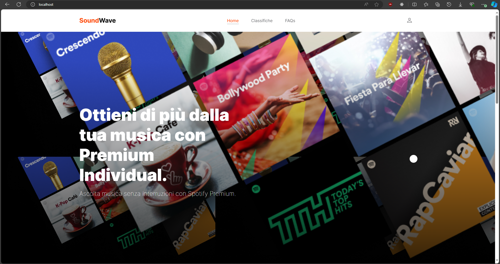

# Progetto CER

## Introduzione
Durante il corso di Calcolatori Elettronici e Reti di Calcolatori è stato illustrato un argomento tanto attuale quanto interessante, ovvero le tipologie di virtualizzazione. Per la realizzazione della tesina è stato scelto come argomento Docker per trattare ed illustrare alcuni degli strumenti odierni che ci permettono di sfruttare la virtualizzazione a livello di SO. Il progetto mira a dimostrare le potenzialità di Docker nel contesto del cloud computing attraverso la creazione e l'implementazione di una piccola applicazione web di test adeguatamente organizzata in container. 

## Docker e Container OCI
Un container è un'unità standard (definita dalla OCI per opera della Linux Foundation) di software che impacchetta il codice dell'applicazione e tutte le sue dipendenze, garantendo che l'applicazione possa funzionare in modo rapido e affidabile su qualsiasi ambiente di elaborazione. A differenza della virtualizzazione a livello hardware, i container sono leggeri, si avviano rapidamente garantendo maggiori prestazioni e un consumo minore di risorse hardware. Virtualmente forniscono un ambiente isolato per le applicazioni, impedendo che i conflitti di dipendenze influenzino altre applicazioni eseguite sullo stesso sistema e questo isolamento migliora la sicurezza e la stabilità delle applicazioni. Poiché i container sono isolati e includono tutto il necessario per eseguire un'applicazione, possono essere spostati tra diversi ambienti senza modifiche. Questo assicura che l'applicazione funzioni in modo coerente in ambienti di sviluppo, test e produzione. Attualmente esistono engine che permettono il loro uso e la gestione del loro ciclo di vita. Uno di questi è Docker.

Docker è una tecnologia di containerizzazione che permette agli sviluppatori di creare, distribuire e gestire applicazioni in container.La piattaforma è composta principalmente dal Docker Engine, che è il cuore del sistema. Esso consiste in un'applicazione client-server che include il Docker Daemon, un servizio in background che gestisce i container, e il Docker Client, un'interfaccia a riga di comando utilizzata per interagire con il daemon. Con Docker è semplice aggiungere o rimuovere istanze di container in base alla domanda, consentendo alle applicazioni di scalare orizzontalmente in modo efficiente. Questo è particolarmente utile per le applicazioni basate su microservizi, dove ogni componente dell'applicazione può essere eseguito in un container separato. I principali vantaggi di Docker svolgono un ruolo cruciale anche nella fase di sviluppo di applicazioni; esso permette una facile integrazione nel processo di sviluppo e distribuzione delle applicazioni CI/CD permettendo di migliorare l'efficienza delle risorse, di ridurre i costi operativi e soprattutto la gestione del ciclo di vita delle applicazioni, dalla creazione e test fino alla distribuzione e al monitoraggio.

## Idea e sviluppo
Il progetto consiste in una web app di un'azienda simulata che offre un servizio di musica streaming a pagamento. La web app presenta tre pagine:

#### Home page
La home page presenta tutte le informazioni simulate dell'azienda.



#### Classifica
Questa pagina presenta una classifica fittizia dei migliori brani del momento. Tutti i brani presentati sono disponibili tramite il lettore web di Spotify. 


#### FAQ
Questa pagina presenta delle faq fittizie memorizzate all'interno di un database.


### Sviluppo
La web app realizzata si presenta come una app multi-container che sfrutta diversi servizi per funzionare al meglio. Lo stack di container è stato realizzato attraverso un apposito file docker-compose che costruisce ed inizializza tre container che costituiscono i tre servizi principali dell'app:


#### Proxy server
L'immagine del container è stata costruita partendo da un'immagine di base di Nginx per poi essere modificata con l'aggiunta di una configurazione personalizzata. Il proxy server è stato aggiunto solo a scopo dimostrativo, per rendere il progetto tanto più vicino alle web app presenti in ambito professionale.

#### App
Il container della web app si basa su un'immagine NodeJS opportunamente configurata secondo le esigenze del progetto all'interno di un Dockerfile.
La web app è stata realizzata in ambiente NodeJS che sfrutta ExpressJs per le funzionalità web-server, il tutto realizzato con Typescript. I contenuti di alcune pagine web presenti nella base di dati sono ottenute tramite il pacchetto Sequelize che fornisce l'ORM necessario. Per la realizzazione del frontend si è optato per un template engine TwigJs che ha facilitato il render delle pagine web dinamiche.

#### Database
Il database è stato realizzato tramite un container costruito con un'immagine di Postgres. All'interno sono memorizzati i testi delle faq e le informazioni sui brani e i rispettivi lettori web.

## Modalità d'uso
Per utilizzare il progetto e provare il suo corretto funzionamento è necessario eseguire alcuni passaggi fondamentali. Come anticipato prima, l'applicazione gira in container Docker quindi sarà necessario costruirne tutte le immagini necessarie per i container e avviarli. Fortunatamente tutto ciò viene automatizzato da Docker e quindi basterà lanciare un solo comando per la costruzione dell'infrastruttura:

```
docker compose --env-file ./dev.env up
```
> Nel comando è presente anche l'integrazione di un file .env necessario per le credenziali del db e altro. Il file è stato aggiunto per dimostrare la flessibilità di Docker nel passare tra i vari ambienti di sviluppo.

Una volta avviati tutti i container, per usufruire dell'app sarà necessario effettuare le migrations del db e successivamente i seed. Entrare nel container dell'app node, spostarsi nella cartella del codice sorgente e lanciare il comando:

```
npx sequelize-cli db:migrate
```
e successivamente:

```
npx sequelize-cli db:seed:all
```

Una volta effettuato il seed, l'app sarà pronta per l'uso e raggiungibile su  ```localhost:80```
## Riconoscimenti
Il progetto è stato ideato e realizzato da Michele Bevilacqua.


